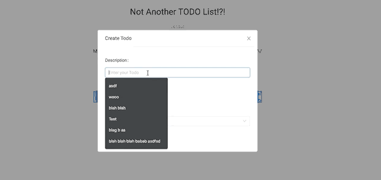

# notanothertodo

React Typescript Nodejs TODO app

A todo app made with Reactjs, Typescript, Nodejs and Sqlite.

## Installation

Clone this repository and run npm install.

**Server Side**

1. Open a terminal
2. Seed the database: npm run seed:db
3. Start the server: npm run dev:server

**Client Side**

1. Open a second terminal
2. run client dev server: npm run dev:client
3. Open in the browswer at localhost:8000

Use these credentials to start creating todos:

```
user01@gmail.com
superdupersecure01
```


